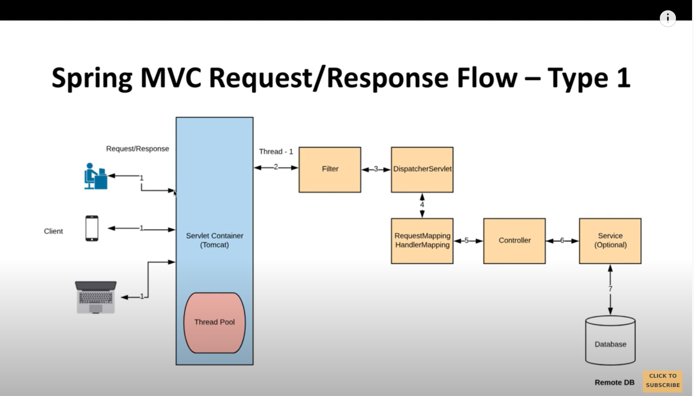

How we handle Concurrent Requests :- 
We are using Thread per request model, so tomcat will take the
thread from thread pool and assign it to http request.
https://www.youtube.com/watch?v=IK26KdGRl48&list=PLnXn1AViWyL70R5GuXt_nIDZytYBnvBdd 

Traditional Rest Api:- Blocking and Synchronous
To make call asynchronous, non-blocking. We have two options:
1. Callbacks
2. Futures(Completable futures)
https://www.youtube.com/watch?v=IGekSCoJav0&list=PLnXn1AViWyL70R5GuXt_nIDZytYBnvBdd&index=2

